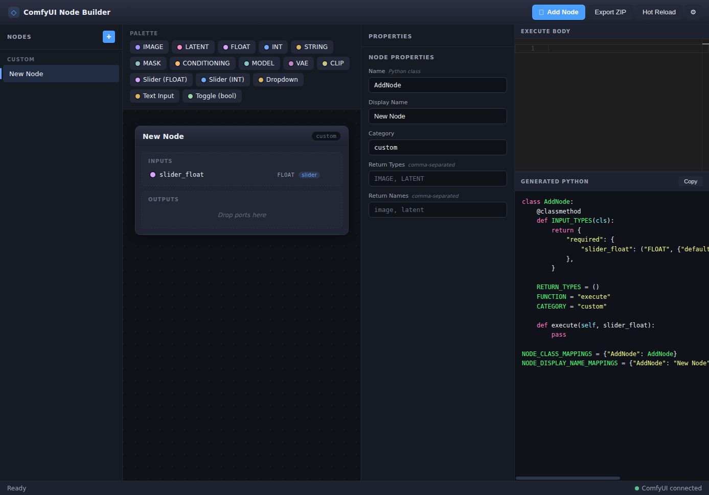

# ComfyUI Node Builder

ComfyUI Node Builder is a local workbench for designing, editing, validating, exporting, and deploying ComfyUI custom node packs. It gives you a structured node editor, a Monaco-powered Python workspace, generated pack files, dependency helpers, local terminal checks, AI-assisted editing, and a managed deployment path into your ComfyUI installation.

**Live landing page:** <https://caoool.github.io/comfyui-node-canvas/>



## What It Does

ComfyUI custom nodes are powerful, but the authoring loop can be repetitive: define the Python class, wire `INPUT_TYPES`, keep return metadata in sync, build `NODE_CLASS_MAPPINGS`, add frontend display hooks, package files, restart ComfyUI, and repeat after every change.

This project turns that loop into a focused local app:

- Create ComfyUI node packs from templates.
- Add inputs, outputs, widgets, and Return UI displays through a visual contract editor.
- Edit the generated Python source in a full-file Monaco editor.
- Manage `requirements.txt`, `install.py`, shared helper files, and custom ComfyUI frontend renderers.
- Export a pack as a ZIP or deploy it directly to `<ComfyUI>/custom_nodes/<pack-folder>/`.
- Store builder-owned metadata in `builder.project.json` so packs can be loaded back into the workbench.
- Run lightweight terminal checks in a pack workspace.
- Ask the AI Builder to create, revise, validate, test, or deploy nodes with explicit controls.

## Who Should Use It

Use this project if you:

- build ComfyUI custom nodes and want a faster edit-test loop
- prototype image, latent, mask, audio, text, or utility nodes
- want generated ComfyUI boilerplate without giving up direct Python editing
- need a repeatable local workflow for deploying a node pack into ComfyUI
- are exploring AI-assisted node authoring but still want validation and visible file changes

It is especially useful for custom node authors who know enough Python to write node behavior, but do not want every experiment to start by rebuilding the same ComfyUI package structure by hand.

## Highlights

- **Three-pane workbench:** node library and contract tools on the left, live node preview in the center, pack files and Python source on the right.
- **Template-first authoring:** start from blank, image pass-through, image transform, latent transform, mask utility, text utility, string preview, and multi-output nodes.
- **Visual node contract:** add standard ComfyUI data ports, widgets, custom inputs, custom outputs, and Return UI displays.
- **Generated pack files:** build node Python files, `__init__.py`, runtime UI display scripts, custom renderer scripts, requirements, install scripts, and shared files.
- **Full Python editing:** edit the complete selected node source while the builder syncs supported contract changes back into the project model.
- **Managed pack workflow:** deploy builder-owned packs with `builder.project.json` for reliable reload/import.
- **Deploy pipeline:** write files, install dependencies when needed, request a ComfyUI restart, and report diagnostics.
- **Local helper server:** file system, terminal, AI provider, and ComfyUI restart actions go through a loopback Express helper.
- **AI Builder:** optional panel for provider-backed edits, validation, terminal commands, and deployment requests.

## Quick Start

Requirements:

- Node.js 22 or newer is recommended because the helper server runs TypeScript with Node's strip-types support.
- A local ComfyUI checkout if you want direct deploy/load behavior.
- ComfyUI Extension Manager if you want the app to request restarts after deploy.

Install and run:

```bash
npm install
npm run dev
```

The dev script starts both pieces of the app:

- Vite frontend, usually at `http://localhost:5173`
- helper server at `http://127.0.0.1:3001`, proxied through `/helper` during development

Open the Vite URL in your browser. Then open Settings from the status bar and configure:

- **ComfyUI URL:** usually `http://127.0.0.1:8188`
- **ComfyUI Install Path:** the folder that contains ComfyUI's `custom_nodes` directory
- **Pack Name / ComfyUI Folder:** the local project name and deployed folder name

## Basic Workflow

1. Choose a node template in the left **Nodes** panel and click **New**.
2. Add inputs, outputs, widgets, and Return UI items from **Add to Node**.
3. Click ports, widgets, or Return UI items in the preview to edit their details.
4. Edit the selected node Python file in the code workspace.
5. Review generated files such as `__init__.py`, `requirements.txt`, `install.py`, and `web/runtimeUiDisplays.js`.
6. Use the terminal panel for small checks such as `python -V` or syntax validation.
7. Export a ZIP for manual installation, or click **Deploy & Restart** to write into ComfyUI.
8. Refresh ComfyUI and test the generated nodes in a workflow.

## Managed Pack Deployment

Direct deploy writes the active pack to:

```text
<ComfyUI install path>/custom_nodes/<pack-folder>/
```

The deployed folder includes generated files and:

```text
builder.project.json
```

That metadata is the builder's source of truth for loading a deployed pack back into the app. The workbench intentionally does not try to reverse-engineer arbitrary third-party custom node packs. Reliable round-trip editing is for packs created or imported by this builder.

## Documentation

The README is the overview. The wiki pages are the detailed manual:

- [Wiki index](docs/wiki/index.md)
- [Getting started](docs/wiki/getting-started.md)
- [Using the workbench](docs/wiki/using-the-workbench.md)
- [Creating nodes](docs/wiki/creating-nodes.md)
- [Deploying to ComfyUI](docs/wiki/deploying-to-comfyui.md)
- [Project structure](docs/wiki/project-structure.md)
- [Troubleshooting](docs/wiki/troubleshooting.md)

## Development Commands

```bash
npm run dev        # Start Vite and the loopback helper server
npm run server     # Start only the helper server
npm run mcp        # Start the local MCP server integration
npm run build      # Type-check and build the frontend
npm run preview    # Preview the production build
npm run test       # Run the Vitest suite
```

## Current Boundaries

- The app is a local development workbench, not a hosted service.
- Direct deploy requires file-system access to a local ComfyUI installation.
- Restart requests depend on ComfyUI Extension Manager support.
- The browser project registry and AI settings are stored in local storage.
- The helper server binds to loopback and only accepts sensitive actions from loopback origins.
- Existing custom node packs without `builder.project.json` are not automatically converted into editable builder projects.

## Repository Layout

```text
src/                 Vue app, stores, components, and client-side pack builders
server/              Express helper server for local file, AI, terminal, and ComfyUI actions
tests/               Vitest unit and component tests
docs/wiki/           User-facing guide and wiki pages
docs/superpowers/    Design and implementation notes for this repo
public/              Static browser assets
```
