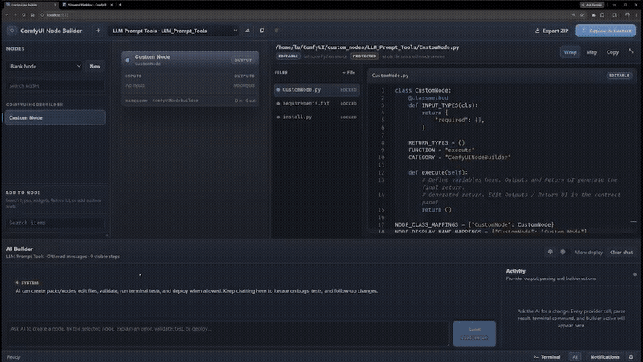
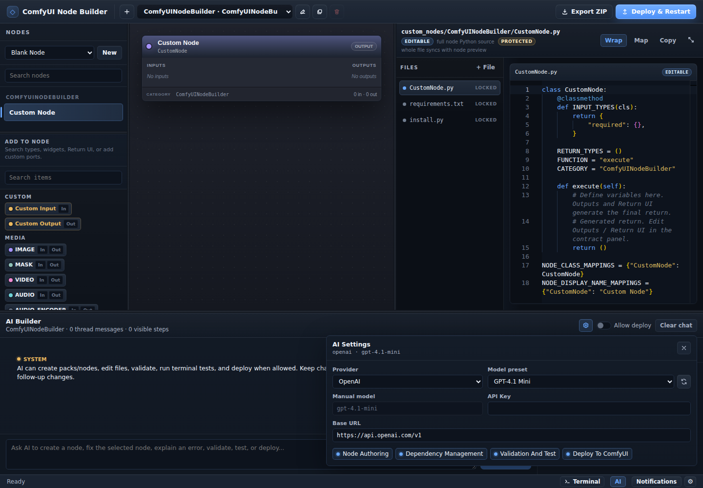

# ComfyUI Node Builder · AI GUI for Custom Nodes

Build powerful ComfyUI custom node packs with a visual GUI and AI.

<p>
  <a href="https://caoool.github.io/comfyui-node-canvas/"></a>
  <a href="https://github.com/caoool/comfyui-node-canvas/stargazers"></a>
  <a href="https://github.com/caoool/comfyui-node-canvas/issues"></a>
  
  
  
</p>

🌐 **Landing page / 项目主页:** <https://caoool.github.io/comfyui-node-canvas/>

📖 **Languages:** [English](#english) · [中文](#中文)

⭐ **Star this repo if it saves you ComfyUI boilerplate:** <https://github.com/caoool/comfyui-node-canvas>

**At a glance:** local GUI app, visual node contract editor, editable generated Python, AI-assisted node creation, validation, ZIP export, and managed deploy into ComfyUI.

**一句话：** 这是一个本地 GUI 应用，用 AI 帮你更快创建、修改、验证、部署和测试 ComfyUI 自定义节点包。





**Demo:** a user asks for a simple LLM prompt-enhancer node; AI creates the node contract and code, updates dependencies, deploys the pack, and the node is tested in ComfyUI.

**演示：** 用户提出一个简单的 LLM 提示词增强节点需求；AI 创建节点接口和代码、更新依赖、部署节点包，并在 ComfyUI 中测试节点。

## Project Links

- [Quick Start](#quick-start): clone, install, run, and create your first node.
- [Wiki / detailed guide](docs/wiki/index.md): setup, workbench, node creation, deployment, project structure, and troubleshooting.
- [GitHub Pages landing page](https://caoool.github.io/comfyui-node-canvas/): short bilingual product page with screenshots.
- [Node ideas](https://github.com/caoool/comfyui-node-canvas/issues/new?template=node_idea.yml): suggest a ComfyUI node or pack for the AI Builder.
- [Feature requests](https://github.com/caoool/comfyui-node-canvas/issues/new?template=feature_request.yml): request GUI, AI, deploy, or validation improvements.
- [Bug reports](https://github.com/caoool/comfyui-node-canvas/issues/new?template=bug_report.yml): report broken behavior with reproduction steps.

## Try These AI Prompts

Use these prompts in the AI Builder to see what the project is designed for:

- "Build a node that takes a simple prompt string and turns it into a stronger image-generation prompt with a small LLM."
- "Create a utility node that reads image metadata and returns seed, model name, and prompt text."
- "Add a batch helper node that takes a folder path and outputs sorted image file paths."
- "Explain why this generated ComfyUI node fails validation and patch the Python file."
- "Add requirements and an install script for this node pack, then validate before deploy."

## Why Star This Project

Stars help ComfyUI node authors find the project, help prioritize AI-assisted node-building features, and make it easier to collect real node ideas from the community.

---

## English

ComfyUI Node Builder is a local GUI app for building ComfyUI custom nodes and full node packs with ease. It gives you a visual node contract editor, generated ComfyUI pack files, direct Python editing, AI-assisted authoring, local checks, ZIP export, and managed deployment into your ComfyUI installation.

### What It Is For

Use it when you want to move from an idea to a working ComfyUI custom node without rebuilding the same pack structure by hand every time.

It is designed for:

- ComfyUI node authors who want a faster edit-test-deploy loop
- workflow builders prototyping image, latent, mask, audio, text, or utility nodes
- Python developers who want generated boilerplate without losing source control
- AI-assisted prototypers who want AI help, but still need visible file changes and validation
- anyone building more complicated ComfyUI packs with dependencies, install scripts, Return UI, or runtime frontend displays

### Why It Exists

ComfyUI custom nodes are powerful, but the authoring loop is repetitive:

- define the Python class and `INPUT_TYPES`
- keep return types, return names, mappings, and categories in sync
- add widgets, custom ports, and Return UI displays
- manage `requirements.txt`, `install.py`, and shared files
- restart ComfyUI after each deploy
- debug generated files when something drifts

This project turns that loop into a structured local workbench.

### AI Features

The AI Builder is built into the workbench, not bolted on as a separate chat page.

It can help you:

- create packs and nodes from a prompt
- revise selected node code and generated files
- explain validation or terminal errors
- validate the generated pack
- run terminal checks in the pack workspace
- request deployment when **Allow deploy** is enabled
- use provider-backed models from OpenAI, OpenRouter, OpenAI-compatible servers, Anthropic, Gemini, or Ollama

Deployment is gated. The assistant can ask for a deploy action, but the UI only emits deploy when you explicitly allow it.



### What The GUI Gives You

- **Visual node contract:** add inputs, outputs, widgets, custom types, Return UI, categories, and metadata.
- **Full Python editing:** edit generated node Python directly in a Monaco-powered workspace.
- **Generated pack files:** inspect node files, `__init__.py`, runtime UI scripts, custom renderers, requirements, install scripts, and shared files.
- **Managed deployment:** export ZIPs or write builder-managed packs into `<ComfyUI>/custom_nodes/<pack-folder>/`.
- **Round-trip metadata:** keep `builder.project.json` so builder-owned packs can be loaded back into the app.
- **Local helper server:** file system writes, AI provider calls, terminal commands, dependency install, and ComfyUI restart requests stay on loopback.

### Quick Start

Requirements:

- Node.js 22 or newer is recommended.
- A local ComfyUI checkout is required for direct deploy/load behavior.
- ComfyUI Extension Manager is recommended if you want restart requests after deploy.

Install and run:

```bash
git clone https://github.com/caoool/comfyui-node-canvas
cd comfyui-node-canvas
npm install
npm run dev
```

The dev script starts:

- Vite frontend, usually at `http://localhost:5173`
- helper server at `http://127.0.0.1:3001`, proxied through `/helper`

Open the Vite URL, then open **Settings** from the status bar and configure:

- **ComfyUI URL:** usually `http://127.0.0.1:8188`
- **ComfyUI Install Path:** the folder that contains ComfyUI's `custom_nodes` directory
- **Pack Name / ComfyUI Folder:** the local project name and deployed folder name

### Basic Workflow

1. Choose a template in the **Nodes** panel and click **New**.
2. Add inputs, outputs, widgets, and Return UI items from **Add to Node**.
3. Edit node metadata and the visual contract in the preview.
4. Edit the generated Python file in the code workspace.
5. Open the AI panel to create, revise, validate, test, or explain the node.
6. Review generated files such as `__init__.py`, `requirements.txt`, `install.py`, and runtime UI scripts.
7. Export a ZIP or click **Deploy & Restart** to write into ComfyUI.
8. Refresh ComfyUI and test the generated node in a workflow.

### Documentation

The README is the overview. The wiki is the detailed guide:

- [Wiki index](docs/wiki/index.md)
- [Getting started](docs/wiki/getting-started.md)
- [Using the workbench](docs/wiki/using-the-workbench.md)
- [Creating nodes](docs/wiki/creating-nodes.md)
- [Deploying to ComfyUI](docs/wiki/deploying-to-comfyui.md)
- [Project structure](docs/wiki/project-structure.md)
- [Troubleshooting](docs/wiki/troubleshooting.md)

### Development Commands

```bash
npm run dev        # Start Vite and the loopback helper server
npm run server     # Start only the helper server
npm run mcp        # Start the local MCP server integration
npm run build      # Type-check and build the frontend
npm run preview    # Preview the production build
npm run test       # Run the Vitest suite
```

### Current Boundaries

- The app is a local development workbench, not a hosted service.
- Direct deploy requires file-system access to a local ComfyUI installation.
- Restart requests depend on ComfyUI Extension Manager support.
- Browser project registry and AI settings are stored in local storage.
- Sensitive helper actions are restricted to loopback origins and loopback ComfyUI URLs where applicable.
- Existing custom node packs without `builder.project.json` are not automatically converted into editable builder projects.

### Repository Layout

```text
src/                 Vue app, stores, components, and client-side pack builders
server/              Express helper server for local file, AI, terminal, and ComfyUI actions
tests/               Vitest unit and component tests
docs/wiki/           User-facing guide and wiki pages
docs/superpowers/    Design and implementation notes for this repo
site/                Static GitHub Pages landing page
public/              Static browser assets
```

---

## 中文

ComfyUI Node Builder 是一个本地 GUI 应用，用来轻松构建 ComfyUI 自定义节点和完整节点包。它把可视化节点接口、生成的 ComfyUI 节点包文件、Python 源码编辑、AI 辅助开发、本地检查、ZIP 导出和托管部署放在同一个工作台里。

### 适合谁使用

如果你想把一个节点想法快速变成可运行的 ComfyUI 自定义节点，而不想每次都手写同一套样板结构，这个项目适合你。

它适合：

- 想提高编辑、测试、部署效率的 ComfyUI 自定义节点作者
- 正在原型设计图像、latent、mask、音频、文本或工具节点的工作流作者
- 想减少样板代码、但仍然要直接控制 Python 源码的开发者
- 希望使用 AI 辅助开发，同时保留可见文件变更和验证步骤的原型开发者
- 需要构建带依赖、安装脚本、Return UI 或前端运行时显示的复杂节点包的人

### 为什么需要它

ComfyUI 自定义节点很强大，但开发循环很重复：

- 定义 Python 类和 `INPUT_TYPES`
- 同步返回类型、返回名称、映射和分类
- 添加控件、自定义端口和 Return UI
- 管理 `requirements.txt`、`install.py` 和共享文件
- 每次部署后重启 ComfyUI
- 在生成文件漂移时排查问题

这个项目把这些步骤整理成一个结构化的本地工作台。

### AI 能力

AI Builder 直接内置在工作台里，不是一个独立的聊天页面。

它可以帮助你：

- 根据提示创建节点包和节点
- 修改选中节点代码和生成文件
- 解释验证错误或终端错误
- 验证生成的节点包
- 在节点包工作目录中运行终端检查
- 在开启 **Allow deploy** 后请求部署
- 使用 OpenAI、OpenRouter、OpenAI-compatible、Anthropic、Gemini 或 Ollama 等模型提供商

部署是有门禁的。AI 可以请求部署动作，但只有你明确开启允许部署后，界面才会发出部署操作。

### GUI 提供什么

- **可视化节点接口：** 添加输入、输出、控件、自定义类型、Return UI、分类和元数据。
- **完整 Python 编辑：** 在 Monaco 工作区中直接编辑生成的节点 Python。
- **生成节点包文件：** 检查节点文件、`__init__.py`、运行时 UI 脚本、自定义渲染器、requirements、安装脚本和共享文件。
- **托管部署：** 导出 ZIP，或把 builder 管理的节点包写入 `<ComfyUI>/custom_nodes/<pack-folder>/`。
- **可回载元数据：** 通过 `builder.project.json` 让 builder 创建的节点包可以再次加载回应用。
- **本地 helper server：** 文件写入、AI 调用、终端命令、依赖安装和 ComfyUI 重启请求都走 loopback。

### 快速开始

要求：

- 推荐 Node.js 22 或更新版本。
- 如果要直接部署或加载节点包，需要本地 ComfyUI 目录。
- 如果希望部署后自动请求重启，推荐安装 ComfyUI Extension Manager。

安装并运行：

```bash
git clone https://github.com/caoool/comfyui-node-canvas
cd comfyui-node-canvas
npm install
npm run dev
```

开发脚本会启动：

- Vite 前端，通常是 `http://localhost:5173`
- helper server：`http://127.0.0.1:3001`，开发环境中通过 `/helper` 代理

打开 Vite 地址，然后从状态栏进入 **Settings**，配置：

- **ComfyUI URL：** 通常是 `http://127.0.0.1:8188`
- **ComfyUI Install Path：** 包含 ComfyUI `custom_nodes` 目录的文件夹
- **Pack Name / ComfyUI Folder：** 本地项目名和部署后的文件夹名

### 基本流程

1. 在 **Nodes** 面板选择模板，然后点击 **New**。
2. 从 **Add to Node** 添加输入、输出、控件和 Return UI。
3. 在预览区编辑节点元数据和可视化接口。
4. 在代码工作区编辑生成的 Python 文件。
5. 打开 AI 面板，让 AI 创建、修改、验证、测试或解释节点。
6. 检查 `__init__.py`、`requirements.txt`、`install.py` 和运行时 UI 脚本等生成文件。
7. 导出 ZIP，或点击 **Deploy & Restart** 写入 ComfyUI。
8. 刷新 ComfyUI，在工作流中测试生成的节点。

### 文档

README 是概览，详细手册在 wiki：

- [Wiki index](docs/wiki/index.md)
- [Getting started](docs/wiki/getting-started.md)
- [Using the workbench](docs/wiki/using-the-workbench.md)
- [Creating nodes](docs/wiki/creating-nodes.md)
- [Deploying to ComfyUI](docs/wiki/deploying-to-comfyui.md)
- [Project structure](docs/wiki/project-structure.md)
- [Troubleshooting](docs/wiki/troubleshooting.md)

### 参与反馈

如果它帮你减少了 ComfyUI 自定义节点样板代码，欢迎给仓库一个 Star。Issue、PR、真实使用场景和 AI 辅助节点开发需求也都很有价值。
